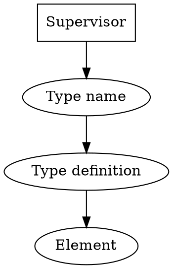

# Get an element from type name

1. Get [a type name](../definitions/TypeName.md) from supervisor
2. Get [a type definition](../definitions/TypeDefinition.md) from type name
   1. If type definition does not exist: [make a type definition from sample and type name](./GetTypeDefinitionFromSampleAndTypeName.md)
3. Get [an element](../definitions/Element.md) from type definition.

